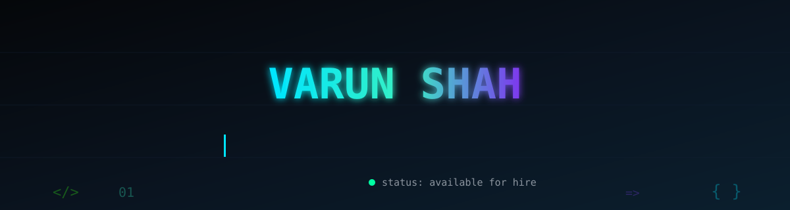
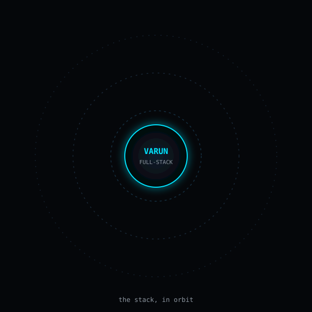

  

  
  
  

 

  

 

<table align="center">
<tr>
<td align="center" width="25%">

**5+**
 years shipping production code

</td>
<td align="center" width="25%">

**−30%**
 load time on a Next.js migration

</td>
<td align="center" width="25%">

**−25%**
 bundle size via custom Webpack

</td>
<td align="center" width="25%">

**0**
 engineering tickets for marketing to edit nav

</td>
</tr>
</table>

 

## Experience

| | | |
|---|---|---|
| 🟢 **Now** | Bacancy Technology | Storyblok + Next.js CMS for IQsight (ex-Bosch) — dynamic mega-menu, Algolia search |
| **2025–26** | ESparkBiz — *Team Lead* | NestJS microservices, doc-signing platform, mentored engineers |
| **2023–25** | Krish Technolabs | Legacy → Next.js migration, BFF layer, MongoDB tuning |
| **2021–23** | Freelance | Adda247 scheduler, WNDY marketplace app |

 

## Projects

<table>
<tr><th>Project</th><th>Problem it Solved</th><th>Stack</th></tr>
<tr><td><b>Dynamic Page Builder</b></td><td>Editors shipping pages without engineering</td><td>Contentful · Next.js</td></tr>
<tr><td><b>E-Commerce Platform</b></td><td>Secure, scalable commerce backend</td><td>Node.js · MongoDB</td></tr>
<tr><td><b>Faculty & Course Portal</b></td><td>Role-based academic workflows</td><td>React · Node.js</td></tr>
</table>

 

## Live Activity

  
  

 

  

  
  

