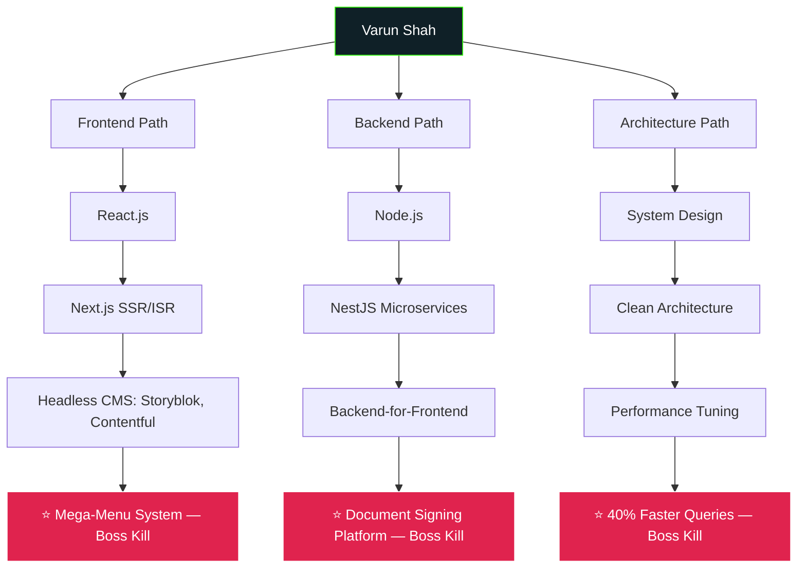

<!-- ============================================================ -->
<!-- TERMINAL BOOT SEQUENCE -->
<!-- ============================================================ -->
<p align="center">
  
</p>

<h1 align="center">🎮 VARUN_SHAH.exe</h1>
<h3 align="center">Full-Stack Engineer · Boss-Fighter of Legacy Codebases</h3>

<br/>

<!-- ============================================================ -->
<!-- CHARACTER SHEET -->
<!-- ============================================================ -->
## 🧙 Character Sheet

```yaml
Class:        Full-Stack Engineer
Guild:        Bacancy Technology Pvt. Ltd.
Level:        5              # years in the field
Alignment:    Ships-Clean-Code-Neutral
Location:     Ahmedabad, India  [Remote Mode: ENABLED]
Status:       ONLINE — accepting side quests (freelance) & full-time contracts
Primary Weapon:  Next.js + TypeScript
Secondary:       NestJS Microservices
Passive Skill:   Turns legacy monoliths into 30%-faster apps while you sleep
```

<table>
<tr><td>

**⚔️ Stat Sheet**


</td><td>

**🧪 Utility Skills**


</td></tr>
</table>

<br/>

<!-- ============================================================ -->
<!-- NEOFETCH STYLE INFO -->
<!-- ============================================================ -->
## 💻 varun --fetch

```
                    ___          varun@portfolio
                   /  /\         ----------------
                  /  /:/_        OS: Ahmedabad, India (Remote-Compatible)
        ___      /  /:/ /\       Uptime: 5+ years in production
       /  /\    /  /:/ /::\      Shell: React / Next.js / Node.js / NestJS
      /  /:/   /  /:/ /:/\:\     Languages: TypeScript, JavaScript
     /  /:/   /__/:/ /:/  \:\    DE: Headless CMS (Storyblok, Contentful)
    /  /::\   \  \:\/:/__\/:/    WM: Microservices + Clean Architecture
   /__/:/\:\   \  \::/~~~~       Terminal: VS Code + Warp
   \__\/  \:\   \  \:\           CPU: Problem-Solving @ 100% utilization
        \  \:\   \  \:\          GPU: Coffee-Accelerated Debugging
         \__\/    \__\/          Memory: 5 companies, 0 regrets
```

<br/>

<!-- ============================================================ -->
<!-- SKILL TREE (Mermaid renders natively on GitHub) -->
<!-- ============================================================ -->
## 🌳 Skill Tree



<br/>

<!-- ============================================================ -->
<!-- QUEST LOG / BOSS BATTLES -->
<!-- ============================================================ -->
## 📜 Quest Log — Boss Battles Defeated

<details open>
<summary><b>🐉 Boss: "IQsight Mega-Menu" — Bacancy Technology (Mar 2026 – Present)</b></summary>
<br/>

> **Difficulty:** ⭐⭐⭐⭐ · **Status:** ✅ In Progress

- Built a Storyblok CMS integration in Next.js with full story-lifecycle management
- Engineered a pixel-perfect multi-level mega-menu — marketing team now edits nav with **zero engineering involvement**
- Integrated Algolia search with custom indexing + faceted filtering
- **Loot dropped:** `Headless CMS Mastery`, `ISR/SSR Architecture`, `Enterprise Nav Systems`

</details>

<details>
<summary><b>🐲 Boss: "The Monolith" — ESparkBiz Technologies (Apr 2025 – Mar 2026)</b></summary>
<br/>

> **Difficulty:** ⭐⭐⭐⭐⭐ · **Status:** ✅ Defeated

- Split a legacy backend into a modular **NestJS microservices** platform
- Architected a document-management & digital-signing system with audit trails
- Led code reviews and mentored junior devs across Agile sprints
- **Loot dropped:** `Team Lead XP +500`, `Microservices Architecture`, `Mentorship Badge`

</details>

<details>
<summary><b>🐍 Boss: "Legacy Load-Time Hydra" — Krish Technolabs (Jan 2023 – Mar 2025)</b></summary>
<br/>

> **Difficulty:** ⭐⭐⭐ · **Status:** ✅ Defeated

- Migrated legacy apps to Next.js → **~30% faster loads**
- Built a Backend-for-Frontend layer for commercetools integrations
- Custom Webpack strategy → **~25% smaller bundles**
- Optimised MongoDB queries → **~40% performance gains**
- **Loot dropped:** `Performance Optimization`, `BFF Pattern`, `OAuth Mastery`

</details>

<details>
<summary><b>⚔️ Boss: "The Freelance Gauntlet" — Independent (2021 – 2023)</b></summary>
<br/>

> **Difficulty:** ⭐⭐⭐ · **Status:** ✅ Defeated

- Built a scheduler app for Adda247's ed-tech platform
- Shipped core modules for WNDY — auth, bidding system, real-time notifications
- Ran full client engagements solo: requirements → architecture → delivery
- **Loot dropped:** `End-to-End Ownership`, `Client Management`, `Solo-Carry Badge`

</details>

<br/>

<!-- ============================================================ -->
<!-- ACHIEVEMENTS -->
<!-- ============================================================ -->
## 🏆 Achievements Unlocked

<p>
  
</p>
<p>
  
  
  
</p>

<br/>

<!-- ============================================================ -->
<!-- INVENTORY / PROJECTS -->
<!-- ============================================================ -->
## 🎒 Inventory (Independent Projects)

| Item | Type | Stats |
|---|---|---|
| 🧱 **Dynamic Page Builder** | Legendary Low-Code Artifact | Contentful · Next.js · SSR · Image Optimization |
| 🛒 **E-Commerce Platform** | Epic Backend Weapon | Node.js · TypeScript · RBAC · Scalable APIs |
| 🎓 **Faculty & Course Portal** | Rare Utility Tool | React · Node.js · Analytics Dashboards |

<br/>

<!-- ============================================================ -->
<!-- LIVE GITHUB SNAKE GAME -->
<!-- ============================================================ -->
## 🐍 The Snake Eats My Contributions

<p align="center">
  
</p>

> This snake is **alive** — a GitHub Action replays it daily, literally eating my contribution graph.
> Setup workflow is in the collapsible below (takes 2 minutes, and almost nobody has this on their profile).

<details>
<summary><b>⚙️ How to activate the snake (copy-paste workflow)</b></summary>
<br/>

Create `.github/workflows/snake.yml` in your `varun-sh02/varun-sh02` repo:

```yaml
name: Generate Snake
on:
  schedule:
    - cron: "0 0 * * *"
  workflow_dispatch:
  push:
    branches: [ main ]

jobs:
  generate:
    runs-on: ubuntu-latest
    steps:
      - uses: Platane/snk@v3
        id: snake
        with:
          github_user_name: varun-sh02
          outputs: |
            dist/github-contribution-grid-snake.svg
            dist/github-contribution-grid-snake-dark.svg?palette=github-dark
      - uses: crazy-max/ghaction-github-pages@v4
        with:
          target_branch: output
          build_dir: dist
        env:
          GITHUB_TOKEN: ${{ secrets.GITHUB_TOKEN }}
```

Push it once, let the Action run, and the SVG above will animate for real on your profile.

</details>

<br/>

<!-- ============================================================ -->
<!-- STATS DASHBOARD -->
<!-- ============================================================ -->
## 📊 Player Stats

<p align="center">
  
  
</p>

<p align="center">
  
</p>

<p align="center">
  
</p>

<br/>

<!-- ============================================================ -->
<!-- SECRET / EASTER EGG -->
<!-- ============================================================ -->
<details>
<summary>🕹️ <b>Konami code found this? Here's the secret debug menu.</b></summary>
<br/>

```
> sudo whoami
varun — turns "it works on my machine" into "it works in production"

> cat todo.txt
[ ] Ship the next mega-menu edge case
[ ] Reply to that recruiter (probably you)
[x] Make this README weirder than the last one
```

</details>

<br/>

<!-- ============================================================ -->
<!-- CONTACT -->
<!-- ============================================================ -->
## 📡 Send a Signal

<p align="center">
  <a href="mailto:varunshah02@icloud.com"></a>
  <a href="https://linkedin.com/in/varun-shah-3a3b8a23b"></a>
  <a href="tel:+918238960631"></a>
</p>

<p align="center">
  
</p>
